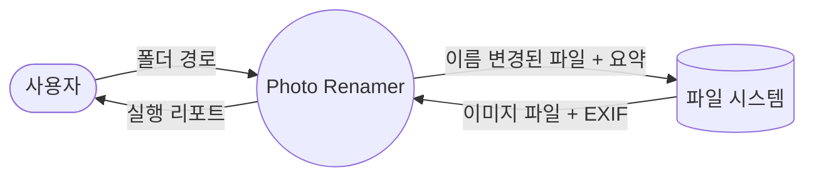

<p align="center">
  
</p>

<h1 align="center">SteakOrder</h1>

<p align="center">
  <em>이해관계자(stakeholder)는 배고프면 steakorder를 한다.</em>
</p>

<p align="center">
  
  
  
</p>

<p align="center">
  <sub><a href="README.md">English</a></sub>
</p>

---

에이전트에게 "사진 정리해 주는 거 하나 만들어줘"라고 하면, 그냥… 시작해 버립니다. 당신이 말하지 않은 빈칸을 알아서 채우고, 요청하지도 않은 모양을 고르고, 절반쯤 만들어진 뒤에야 잘못 짚었다는 걸 알게 됩니다.

steakorder는 그 전에 끼어듭니다. 어떤 웨이터도 "스테이크 하나요"를 그대로 주방에 넣지 않습니다 — 부위, 굽기, 소스, 사이드를 묻죠. steakorder도 빌드 요청을 똑같이 받습니다. 한 번에 하나씩, 직전 답에 맞춰 질문하며, 주문의 모든 부분이 주방의 추측에 맡겨지지 않고 못 박힐 때까지 캐묻습니다. 그런 다음 그 전체를 제대로 적어 **소프트웨어 요구사항 명세서(SRS, ISO/IEC/IEEE 29148)** 파일로 저장합니다 — 검토하거나, 넘겨주거나, 기준 문서로 보관할 수 있는 문서입니다.

```
/steakorder
```

```
steakorder: 무엇을 만들고 싶으세요? 설명해 주셔도 되고,
            기존 명세가 있으면 그걸 주시면 거기서부터 작업할게요.
You:        사진 파일을 촬영 날짜로 이름 바꾸는 CLI를 만들고 싶어요.
steakorder: 무엇을 "완료"로 볼까요?
            a) 파일을 제자리에서 이름 변경
            b) 이름 바꾼 사본을 새 폴더에 복사
            c) 기타 — 직접 알려주기
You:        a
steakorder: 날짜는 어디에서 가져올까요?
            a) 사진의 EXIF 메타데이터
            b) 파일의 수정 시각
            c) 기타 — 직접 알려주기
You:        a — 그리고 EXIF 날짜가 없는 사진은 그냥 건너뛰어 주세요.
...
→ 완성된 ISO 29148 명세를 Markdown 파일로 저장, 그리고: "수정할 부분 있나요?"
```

## 설치

**Claude Code** (플러그인):

```
/plugin marketplace add Jimicro/SteakOrder
/plugin install steakorder@steakorder
```

**claude.ai** (웹): 최신 릴리스에서 [`steakorder.skill`](https://github.com/Jimicro/SteakOrder/releases/latest)을 받아 **Settings → Capabilities → Skills** 에 넣으세요.

**기타 에이전트** — 스킬 디렉터리로 클론하세요:

```bash
git clone https://github.com/Jimicro/SteakOrder.git ~/.claude/skills/steakorder
```

## 사용법

`/steakorder`를 입력하거나, 그냥 만들고 싶은 걸 설명하세요 — 명세 없이 모호한 요청이 들어오면 알아서 끼어듭니다. 이미 SRS 초안·명세·러프한 요구 목록이 있다면 그걸 건네세요. steakorder가 읽고, 이미 다뤄진 부분의 지도를 보여준 뒤, 빈틈만 질문합니다.

모든 질문은 객관식이고, 마지막 선택지는 언제나 탈출구(`기타 — 직접 알려주기`)입니다. 제시된 선택지에 갇히는 일은 없습니다.

## 실제로 하는 일

두 단계로 진행합니다. **Discovery**(발견)는 *시스템이 무엇인지*를 파악합니다 — 목적과 "완료"의 정의, 사용자, 입력과 출력, 경계·실패 케이스, 제약, 우선순위, 그리고 모두가 빼먹는 가정들. **Specification**(명세)은 그 각각을 명세 깊이로 날카롭게 다듬습니다 — 요구별 측정 가능한 합격 기준, 비기능 요구사항(성능·보안·신뢰성과 ISO 25010 품질 항목들), 데이터와 인터페이스 정의, UI, 그리고 다이어그램에 필요한 입력.

모호한 답으로는 어떤 것도 "완료"로 표시되지 않습니다. 각 답은 네 가지 질문을 통과해야 합니다:

- **Unambiguous(명확)** — 해석이 하나뿐인가?
- **Verifiable(검증가능)** — 충족 여부를 테스트할 방법이 있는가?
- **Complete(완전)** — 경계와 실패 케이스가 들어 있는가?
- **Consistent(일관)** — 앞서 말한 것과 모순되지 않는가?

하나라도 실패하면, 약한 지점을 정확히 겨냥한 후속 질문이 하나 더 나갑니다. 확정된 요구사항은 한 번 더 엄격히 점검합니다 — 꼭 필요하고, 한 요구에 한 기능이며, 실현·검증·추적이 가능한지.

## 전체 세션 예시

<details>
<summary>한 줄 요청에서 완성된 명세까지 (클릭해서 펼치기)</summary>

```
You:        /steakorder
steakorder: 무엇을 만들고 싶으세요? 설명해 주셔도 되고,
            기존 명세가 있으면 그걸 주시면 거기서부터 작업할게요.
You:        사진 파일을 촬영 날짜로 이름 바꾸는 CLI요.

steakorder: [Discovery 1/8 · 목적] 무엇을 "완료"로 볼까요?
            a) 파일을 제자리에서 이름 변경
            b) 이름 바꾼 사본을 새 폴더에, 원본은 그대로
            c) 기타 — 직접 알려주기
You:        a

steakorder: [Discovery 3/8 · 입력] 날짜는 어디에서 가져올까요?
            a) 사진의 EXIF "DateTimeOriginal" 메타데이터
            b) 파일의 수정 시각
            c) 기타 — 직접 알려주기
You:        a — 그리고 EXIF 날짜가 없는 사진은 건너뛰어요.

steakorder: [Discovery 4/8 · 경계] 두 사진이 같은 새 이름이 되면
            충돌을 어떻게 처리할까요?
            a) 일련번호 덧붙이기 (…_1, …_2)
            b) 두 번째 파일은 건너뛰고 보고
            c) 기타 — 직접 알려주기
You:        a

steakorder: [Discovery 4/8 · 경계] 폴더엔 이미지가 아닌 파일도 있죠.
            .txt나 .mov를 만나면?
            a) 지원하지 않는 파일은 무시
            b) 전부 시도하고 못 읽으면 에러
            c) 기타 — 직접 알려주기
You:        a — 지원은 일단 .jpg, .heic 만요.

steakorder: [Spec 9 · 합격기준] 바뀐 파일명은 어떤 형식일까요?
            a) YYYY-MM-DD_HHMMSS.ext   (예: 2026-06-28_142530.jpg)
            b) YYYYMMDD_NNN.ext        (날짜 + 순번)
            c) 기타 — 직접 알려주기
You:        a

steakorder: [Spec 10 · 비기능] 한 번에 사진 몇 장 정도이고,
            속도 목표가 있나요?
            a) 최대 ~5,000장, 30초 내 완료
            b) 소량 배치, 속도 무관
            c) 기타 — 직접 알려주기
You:        a

steakorder: 지금까지 정리 —
            • .jpg/.heic를 EXIF DateTimeOriginal로 제자리 이름 변경
            • 형식 YYYY-MM-DD_HHMMSS.ext; 충돌은 _1, _2…
            • EXIF 날짜 없는 사진은 건너뜀; 미지원 파일은 무시
            • 5,000장 이하 30초 내
            남은 빈틈 하나: 한 폴더만, 아니면 하위 폴더까지?
            a) 한 폴더만
            b) 하위 폴더까지 재귀
            c) 기타 — 직접 알려주기
You:        a

steakorder: 모든 영역 충족. photo-renamer-SRS.md 작성 중…
            SRS 나왔습니다 — 수정할 부분 있나요?
```

</details>

## 결과물

요약이 아니라 진짜 SRS입니다 — ISO/IEC/IEEE 29148이 규정한 구조 그대로:

- 목적·범위·이해관계자·제약·가정을 앞부분에.
- 컴포넌트별로 묶은 기능 요구사항 — 각각 측정 가능한 합격 기준, 우선순위, 추적 가능한 출처를 가진 단일 "shall" 문장. 인터페이스·UI·비기능 요구사항도 포함.
- 아키텍처 컨텍스트 다이어그램과 유스케이스 다이어그램 — 스텁이 아니라 실제로 답한 내용으로 Mermaid로 그림.
- 요구사항마다 검증 방법과 합격 조건, 그리고 각 요구를 출처로 되짚는 추적성 표 — 모든 이해관계자가 자기 요청이 반영됐는지 확인할 수 있게.

29148 표준 목차를 그대로 따릅니다:

```
1. 서론             목적 · 범위 · 정의 · 이해관계자 · 참고문헌
2. 전체 설명         제품 관점 · 기능 · 제약 · 가정
3. 구체적 요구사항    기능(컴포넌트별) · 인터페이스 · UI · 비기능
4. 다이어그램        아키텍처 컨텍스트 + 유스케이스 (Mermaid)
5. 검증             요구별 검증 방법 + 합격 조건
6. 추적성           요구 → 출처 → 검증
7. 미해결 이슈        지금 정말 해결 못 하는 것만
```

<details>
<summary>샘플 출력 — 생성된 SRS 발췌 (클릭해서 펼치기)</summary>

````markdown
# Photo Renamer — 소프트웨어 요구사항 명세서 (SRS)
(ISO/IEC/IEEE 29148)

## 1.1 목적
폴더 안의 이미지 파일 이름을 촬영 날짜가 드러나도록 바꿔, 뒤섞인 사진
더미를 이름만으로 시간순 정렬할 수 있게 한다.

## 3.2 기능 요구사항

### 이름 변경
- **FR-REN-01** 도구는 지원 이미지 각각을 EXIF DateTimeOriginal 값으로
  제자리에서 이름 변경**해야 한다**.
  · 입력: 파일 경로 + EXIF 메타데이터 · 출력: 이름 변경된 파일
  · 인수 기준: 결과 이름 = `YYYY-MM-DD_HHMMSS.ext`, 사진 20장 픽스처로
    검증 · 우선순위: P1 · 출처: 성공 기준
- **FR-REN-02** 도구는 두 사진이 같은 대상 이름이 될 때 일련번호
  (`_1`, `_2`, …)를 덧붙여**야 한다**.
  · 인수 기준: 기존 파일을 덮어쓰지 않음; 충돌 건수를 실행 요약에 표시
  · 우선순위: P1 · 출처: 경계 조건

## 3.5 비기능 요구사항
- **NFR-PERF-01** 도구는 일반 노트북에서 사진 최대 5,000장을 30초 이내에
  처리**해야 한다**(검증: 분석 + 시험).

## 4. 다이어그램

````

</details>

ISO/IEC/IEEE 29148, ISO 25010, 그리고 일반적인 요구공학 실무를 바탕으로 만들었습니다.

## 자주 묻는 질문

**코드도 짜주나요?**
아니요. steakorder는 명세에서 멈춥니다 — SRS 문서를 만들고 수정할 부분만 묻습니다. 그 명세로 실제 구현하는 건 사용자가 따로 시작하는 별개 단계입니다.

**UI가 없는 프로젝트면요?**
먼저 물어본 뒤 UI 섹션을 건너뜁니다. 헤드리스 스크립트나 서비스에 없는 화면을 지어내지 않습니다.

**우리 팀의 요구사항 ID 규칙을 쓸 수 있나요?**
네. 기존 문서가 규칙(예: `R-CSO-SFR-001`)을 따르면 그대로 유지하고, 없으면 단순 타입 ID(FR-01, NFR-01)를 기본으로 씁니다.

**사소한 일회성 스크립트도 끝까지 캐묻나요?**
어떤 영역을 "해당 없음"이라고 알려주면 넘어갑니다 — 다만 가정하지 않고 묻기 때문에 중요한 게 조용히 빠지는 일은 없습니다.

**이미 러프한 명세가 있어요. 처음부터 다시 해야 하나요?**
아니요 — 그걸 건네면 document-intake 모드로 전환해, 커버된 부분을 정리하고 빈틈만 물어 깨끗한 SRS를 새로 만듭니다.

## 감사의 말

이 스킬은 KAIST *Software Engineering for AI* 수업(백종문 교수님)에서 출발했으며, Roger S. Pressman·Bruce R. Maxim의 *Software Engineering: A Practitioner's Approach* 를 참고했습니다.

## 라이선스

[MIT](LICENSE) © 2026 Jimicro
