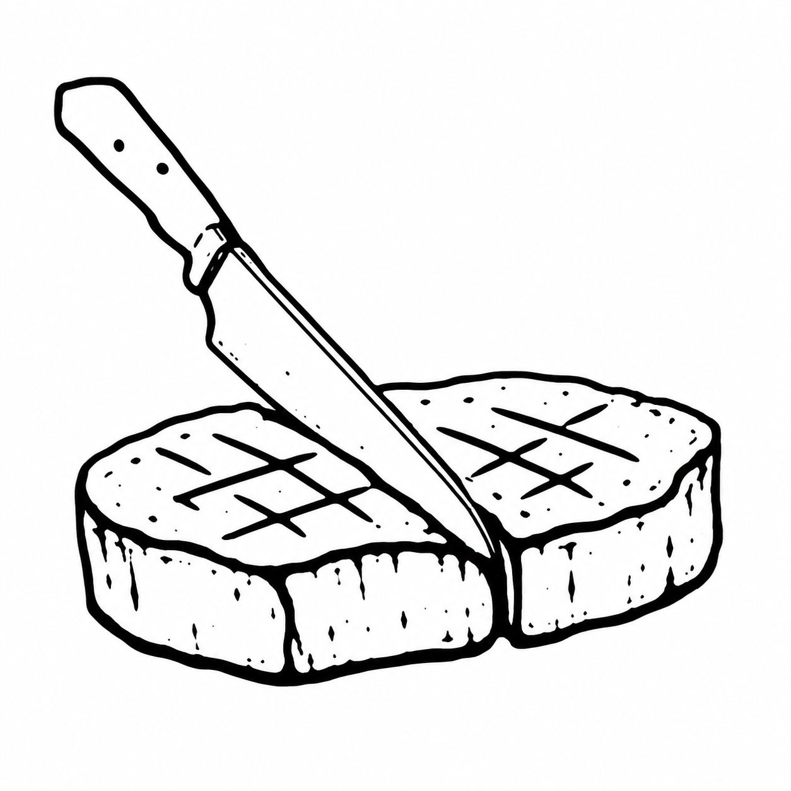
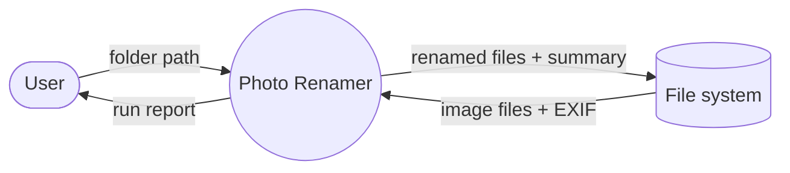

<p align="center">
  
</p>

<h1 align="center">SteakOrder</h1>

<p align="center">
  <em>A hungry stakeholder places a steakorder.</em>
</p>

<p align="center">
  
  
  
</p>

<p align="center">
  <sub><a href="README.ko.md">한국어</a></sub>
</p>

---

You ask an agent to "build me something to sort out my photos," and it just… starts. Fills in the blanks you never specified, picks a shape you didn't ask for, and you only notice it guessed wrong once the thing is half-built.

steakorder steps in before that. No waiter sends "a steak" to the kitchen — they ask the cut, how you want it done, which sauce, what sides. steakorder takes a build request the same way: it asks — one question at a time, each shaped by your last answer — until every part of the order is pinned down instead of left to the kitchen's guess. Then it writes the whole thing up properly, as a **Software Requirements Specification (ISO/IEC/IEEE 29148)** saved to a file — the document you can review, hand off, or keep as the source of truth.

```
/steakorder
```

```
steakorder: What would you like to build? Describe it — or share an
            existing spec and I'll work from that.
You:        I want a CLI that renames my photo files by the date taken.
steakorder: Which counts as "done"?
            a) Rename the files in place
            b) Copy renamed versions into a new folder
            c) Other — tell me directly
You:        a
steakorder: Where should the date come from?
            a) The photo's EXIF metadata
            b) The file's modified time
            c) Other — tell me directly
You:        a — and just skip any photo with no EXIF date.
...
→ a full ISO 29148 spec, written to a Markdown file, then: "Anything to change?"
```

## Install

**Claude Code** (plugin):

```
/plugin marketplace add Jimicro/SteakOrder
/plugin install steakorder@steakorder
```

**claude.ai** (web): grab [`steakorder.skill`](https://github.com/Jimicro/SteakOrder/releases/latest) from the latest release and drop it into **Settings → Capabilities → Skills**.

**Other agents** — clone it into your skills directory:

```bash
git clone https://github.com/Jimicro/SteakOrder.git ~/.claude/skills/steakorder
```

## Using it

Type `/steakorder`, or just describe what you want to build — it steps in on its own when a request shows up without a real spec. Already have an SRS draft, a spec, or even a loose requirement list? Hand it over instead: steakorder reads it, shows you a map of what's already covered, and only asks about the gaps.

Every question is multiple choice, and the last option is always an out (`Other — tell me directly`), so you're never boxed in by the choices it offers.

## What it actually does

It works in two passes. **Discovery** figures out *what the system is* — the purpose and what "done" means, who uses it, inputs and outputs, the edges and failure cases, constraints, priorities, and the assumptions everyone forgets to state. **Specification** then sharpens each of those to spec depth: measurable acceptance criteria per requirement, non-functional requirements (performance, security, reliability, and the rest of the ISO 25010 list), data and interface definitions, the UI, and the inputs its diagrams need.

Nothing gets marked "done" on a vague answer. Each one has to survive four questions:

- **Unambiguous** — only one way to read it?
- **Verifiable** — is there a way to test it?
- **Complete** — are the edges and failure cases in?
- **Consistent** — does it contradict something you said earlier?

Anything that fails gets one sharper follow-up aimed straight at the weak spot. Requirements that make it into the final spec get one more strict pass — each one has to be genuinely needed, a single capability, and feasible, verifiable, and traceable.

## A full session

<details>
<summary>From a one-line request to a finished spec (click to expand)</summary>

```
You:        /steakorder
steakorder: What would you like to build? Describe it — or share an
            existing spec and I'll work from that.
You:        A CLI that renames my photo files by the date they were taken.

steakorder: [Discovery 1/8 · Purpose] What counts as "done"?
            a) Rename the files in place
            b) Copy renamed versions into a new folder, originals untouched
            c) Other — tell me directly
You:        a

steakorder: [Discovery 3/8 · Input] Where should the date come from?
            a) The photo's EXIF "DateTimeOriginal" metadata
            b) The file's last-modified time
            c) Other — tell me directly
You:        a — and skip any photo that has no EXIF date.

steakorder: [Discovery 4/8 · Boundary] When two photos resolve to the same
            new name, how should the collision be handled?
            a) Append a counter (…_1, …_2)
            b) Skip the second file and report it
            c) Other — tell me directly
You:        a

steakorder: [Discovery 4/8 · Boundary] A folder usually holds non-image
            files too. What about a .txt or .mov it runs into?
            a) Ignore anything that isn't a supported image
            b) Try every file, error on the unreadable ones
            c) Other — tell me directly
You:        a — supported = .jpg and .heic for now.

steakorder: [Spec 9 · Acceptance] What should a renamed file look like?
            a) YYYY-MM-DD_HHMMSS.ext   (e.g. 2026-06-28_142530.jpg)
            b) YYYYMMDD_NNN.ext        (date + sequence)
            c) Other — tell me directly
You:        a

steakorder: [Spec 10 · Non-functional] Roughly how many photos per run, and
            is there a speed target?
            a) Up to ~5,000 photos, finish within 30s
            b) Small batches, speed doesn't matter
            c) Other — tell me directly
You:        a

steakorder: Recap so far —
            • Rename .jpg/.heic in place by EXIF DateTimeOriginal
            • Format YYYY-MM-DD_HHMMSS.ext; collisions get _1, _2…
            • Skip photos with no EXIF date; ignore unsupported files
            • ≤5,000 photos within 30s
            One gap left: one folder only, or recurse into subfolders?
            a) Single folder only
            b) Recurse into subfolders
            c) Other — tell me directly
You:        a

steakorder: Every area's covered. Writing photo-renamer-SRS.md …
            Here's the SRS — anything to change?
```

</details>

## What you get

A real SRS, not a summary — structured the way ISO/IEC/IEEE 29148 lays it out:

- Purpose, scope, stakeholders, constraints, and assumptions up front.
- Functional requirements grouped by component, each a single *shall* statement with a measurable acceptance criterion, a priority, and a traceable source — plus interface, UI, and non-functional requirements.
- An architecture context diagram and a use-case diagram, drawn in Mermaid from what you actually said, not stubs.
- A verification method and pass condition for every requirement, and a traceability table linking each one back to where it came from — so every stakeholder can see their request made it in.

It follows the standard 29148 outline:

```
1. Introduction          purpose · scope · definitions · stakeholders · references
2. Overall description    product perspective · functions · constraints · assumptions
3. Specific requirements  functional (by component) · interfaces · UI · non-functional
4. Diagrams               architecture context + use-case (Mermaid)
5. Verification           method + pass condition per requirement
6. Traceability           requirement → source → verification
7. Open issues            only what genuinely can't be resolved yet
```

<details>
<summary>Sample output — an excerpt of the generated SRS (click to expand)</summary>

````markdown
# Photo Renamer — Software Requirements Specification
(ISO/IEC/IEEE 29148)

## 1.1 Purpose
Rename image files in a folder so each filename reflects the date the photo
was taken, making a flat photo dump sortable into chronological order by name.

## 3.2 Functional requirements

### Renaming
- **FR-REN-01** The tool shall rename each supported image in place using its
  EXIF DateTimeOriginal value.
  · input: file path + EXIF metadata · output: renamed file
  · acceptance: resulting name = `YYYY-MM-DD_HHMMSS.ext`, verified on a fixture
    set of 20 photos · priority: P1 · source: success criterion
- **FR-REN-02** The tool shall append a numeric suffix (`_1`, `_2`, …) when two
  photos resolve to the same target name.
  · acceptance: no existing file is overwritten; collisions counted in the
    run summary · priority: P1 · source: boundary condition

## 3.5 Non-functional requirements
- **NFR-PERF-01** The tool shall process up to 5,000 photos within 30 s on a
  typical laptop (verification: analysis + test).

## 4. Diagrams

````

</details>

It's built on ISO/IEC/IEEE 29148, ISO 25010, and ordinary requirements-engineering practice.

## FAQ

**Does it write the code too?**
No. steakorder stops at the spec — it produces the SRS document and asks if anything needs changing. Building from the spec is a separate step you start yourself.

**What if my project has no UI?**
It asks first, then skips the UI section. It won't invent screens for a headless script or service.

**Can it use my team's requirement ID scheme?**
Yes. If your existing docs follow a convention (e.g. `R-CSO-SFR-001`), it keeps it; otherwise it defaults to simple typed IDs (FR-01, NFR-01).

**Won't it interrogate a trivial one-off script to death?**
You can tell it an area is "not applicable" and it moves on — but it asks rather than assuming, so nothing important is silently skipped.

**I already have a rough spec. Do I start over?**
No — hand it over and it switches to document-intake mode: it maps what's covered, asks only about the gaps, and regenerates a clean SRS.

## Acknowledgments

This skill grew out of the *Software Engineering for AI* course at KAIST, taught by Prof. Jongmoon Baik, and draws on *Software Engineering: A Practitioner's Approach* by Roger S. Pressman and Bruce R. Maxim.

## License

[MIT](LICENSE) © 2026 Jimicro
